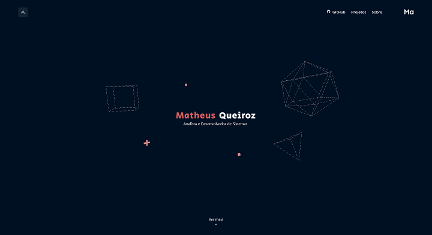

  

    <h1>My Personal Website</h1>
    
  

  

    
  

## Stack de Desenvolvimento
+ [Next.js](https://nextjs.org/) - Um framework baseado em React
+ [Chakra UI](https://chakra-ui.com/) - Um biblioteca simples, modular e acessível de componentes para React
+ [Three.js](https://threejs.org/) - Biblioteca 3D para JavaScript
+ [Framer Motion](https://www.framer.com/motion/) - Uma biblioteca de animação para reac

---

### Sobre Este Site
Parte do código utilizado na confecção deste site foi disponibilizado por [@devaslife](https://www.craftz.dog/)
